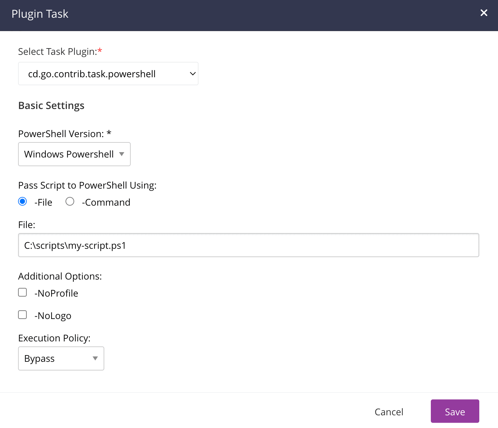

# GoCD PowerShell Task Plugin

GoCD task plugin to run PowerShell scripts

## Prerequisites
GoCD Agents running this task must either run on Windows (with Windows PowerShell) or on an operating system with PowerShell 7+ installed.  The `PowerShell.exe` and/or `pwsh` executables **MUST** be on the system path.

PowerShell is supported on Windows, macOS, and a variety of Linux platforms. For more information, see [Installing PowerShell](https://learn.microsoft.com/en-us/powershell/scripting/install/installing-powershell?view=powershell-7.5).

See also: [PowerShell/PowerShell README.md](https://github.com/PowerShell/PowerShell?tab=readme-ov-file#get-powershell).

## Troubleshooting

### Error: `Validation failed.`
> Error(s): [Validation failed.]. Please correct and resubmit.

#### Possible Cause
This error appears when you configure the PowerShell Task in `Command` mode.  `File` Mode is not affected.  The PowerShell Command script that you've supplied likely has a comment in it somewhere. Something about the *hashtag* (`#`) character causes it to fail to validate.

This does not seem to be an issue with the plugin, but rather GoCD Server.  See
[gocd/gocd GoFileConfigDataSource.java#L476-L505](https://github.com/gocd/gocd/blob/25.1.0/server/src/main/java/com/thoughtworks/go/config/GoFileConfigDataSource.java#L476-L505)

#### Solution
Use `File` mode for the task, or remove all comments from the PowerShell Command.
